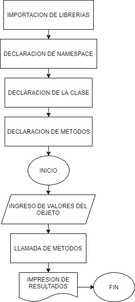

<h2 align="center">INSTITUTO POLITÉCNICO NACIONAL</h2>
<p>&nbsp;</p>
<p>&nbsp;</p>
<h2 align="center">ESCUELA SUPERIOR DE INGENIERÍA ELÉCTRICA Y MECÁNICA UNIDAD ZACATENCO</h2>
<p>&nbsp;</p>
<p>&nbsp;</p>
<h2 align="center">PROGRAMACIÓN ORIENTADA A OBJETOS</h2>
<p>&nbsp;</p>
<p>&nbsp;</p>
<h2 align="center">REPORTE DE PRÁCTICAS NO.1</h2>
<p>&nbsp;</p>
<p>&nbsp;</p>
<h2 align="center">CARLOS ALBERTO HERRERA RANGEL</h2>
<p>&nbsp;</p>
<p>&nbsp;</p>
<h2 align="center">2AM2</h2>

<div class="page"/>

## TABLA DE CONTENIDOS

- [TABLA DE CONTENIDOS](#tabla-de-contenidos)
- [INTRODUCCIÓN](#introducción)
- [DESARROLLO](#desarrollo)
  - [ALGORITMO](#algoritmo)
  - [PSEUDOCODIGO](#pseudocodigo)
  - [CODIGO](#codigo)
  - [EJECUTABLE](#ejecutable)
- [CONCLUSIONES](#conclusiones)
- [BIBLIOGRAFIA](#bibliografia)

<div class ="page"/>

## INTRODUCCIÓN

En esta practica se realizara la creacion de una clase la cual nos permitira crear objetos con las propiedades de un cuadrado, dicha clase tendra como metodo el area de dicho cuadrado segun los los valores dados.

<div class ="page"/>

## DESARROLLO

### ALGORITMO

<div align="center">
  
</div>

<div class = "page"/>

### PSEUDOCODIGO

```
incluir <iostream>
usar espacioNombre std;
clase cuadrado{
    entero base, altura;
    publico:
        vacio mostrar(enero,entero);
        entero area(){retornar base * altura;}
};
vacio cuadrado::mostrar(int h, int b){
    base = b;
    altura = h;
}
entero principal(){
    cuadrado cuadrado1;
    cuadrado1.mostrar(2,6);
    salida<<"Area: "<<cuadrado1.area()<<finLinea;
    retornar 0;
}
```

<div class ="page"/>

### CODIGO

```cpp
#include <iostream>
using namespace std;
class cuadrado{
    int base, altura;
    public:
        void mostrar(int,int);
        int area(){return base * altura;}
};
void cuadrado::mostrar(int h, int b){
    base = b;
    altura = h;
}
int main(){
    cuadrado cuadrado1;
    cuadrado1.mostrar(2,6);
    cout<<"Area: "<<cuadrado1.area()<<endl;
    return 0;
}
```

<div class ="page"/>

### EJECUTABLE

```powershell
$ cd "c:\Users\xXC4R\Desktop\Programacion\1er_parcial\02-09-22\" ; if ($?) { g++ main.cpp -o main } ; if ($?) { .\main }
Area: 12
```

<div class ="page"/>

## CONCLUSIONES

En esta practica aprendimos a realizar una clase darle atributos, crear y llamar metodos dentro y fuera de esta, ademas de crear objetos.

<div class ="page"/>

## BIBLIOGRAFIA

- #### Ejercicios de clase

<div class = "page"/>