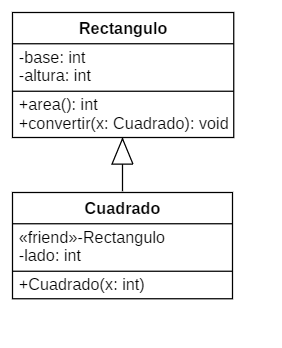
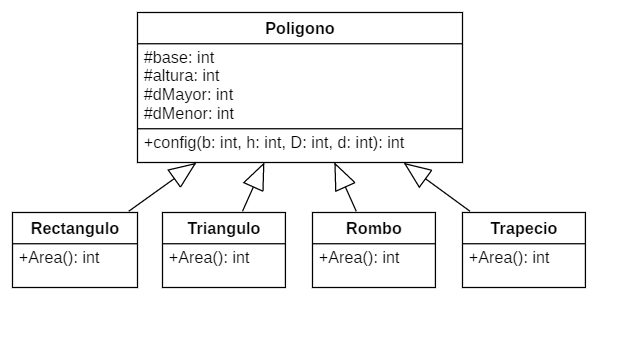

<h1 aling="Center">Ejercicios 11/03/2022</h1>

## 1. Ejercicio 1

### 1.1 Diagrama



### 1.2 Pseudocodigo

```
#incluir <iostream>
utilizando el espacio de nombres estándar;
clase Cuadrado;
clase Rectángulo{
    int base, altura;
público:
    int area() { return base * altura; }
    void convertir(Cuadrado x);
};
clase Cuadrado{
    amigo Rectángulo;
privado:
    lado interior;
público:
    Cuadrado(int x) : lado(x) {}
};
void Rectangulo::convertir(Cuadrado x){
    base = x.lado;
    altura = x.lado;
}
int principal(){
    Rectángulo recto;
    Cuadrado cuadrado(8);
    rect.convertir(cuad);
    cout << "Área: " << rect.area() << endl;
    devolver 0;
}
```

### 1.3 Codigo.

```c++
#include <iostream>
using namespace std;
class Cuadrado;
class Rectangulo{
    int base, altura;
public:
    int area() { return base * altura; }
    void convertir(Cuadrado x);
};
class Cuadrado{
    friend Rectangulo;
private:
    int lado;
public:
    Cuadrado(int x) : lado(x) {}
};
void Rectangulo::convertir(Cuadrado x){
    base = x.lado;
    altura = x.lado;
}
int main(){
    Rectangulo rect;
    Cuadrado cuad(8);
    rect.convertir(cuad);
    cout << "Area: " << rect.area() << endl;
    return 0;
}
```

### 1.4. Ejecutable
```console
$ cd "c:\Users\xXC4R\Desktop\Programacion\2ndo_parcial\03-11-22\" ; if ($?) { g++ tempCodeRunnerFile.cpp -o tempCodeRunnerFile } ; if ($?) { .\tempCodeRunnerFile }
Area: 64
```

## 2. Ejercicio 2

### 2.1 Diagrama



### 2.2 Pseudocodigo

```console
#incluir <iostream>
utilizando el espacio de nombres estándar;
clase Polígono{
protegido:
    int base, altura, dMayor, dMenor;
público:
    void config(int b, int h, int D, int d) { base = b, altura = h, dMayor = D, dMenor = d; }
};
clase Rectangulo : poligono publico{
público:
    int area() { return base * altura; }
};
clase Triangulo : poligono publico{
público:
    int area() { return (base * altura) / 2; }
};
clase Rombo: Poligono publico{
público:
    int area() { return (dMayor * dMenor) / 2; }
};
clase Trapecio : poligono publico{
público:
    int area() { return (dMayor * dMenor) / 2; }
};
int principal(){
    Rectángulo rec0;
    triangulo tria0;
    Rombo rom0;
    trapecio tra0;
    rec0.config(2, 4, 0, 0);
    tria0.config(2, 4, 0, 0);
    rom0.config(0, 0, 2, 4);
    tra0.config(0, 0, 2, 4);
    cout << "AREA" << endl << "Rectangulo:\t" << rec0.area() << endl << "Triangulo:\t" << tria0.area() << endl << "Rombo: \t\t" << rom0.area() << endl << "Trapecio\t" << tra0.area() << endl;
    devolver 0;
}
```

### 2.3 Codigo

```c++
#include <iostream>
using namespace std;
class Poligono{
protected:
    int base, altura, dMayor, dMenor;
public:
    void config(int b, int h, int D, int d) { base = b, altura = h, dMayor = D, dMenor = d; }
};
class Rectangulo : public Poligono{
public:
    int area() { return base * altura; }
};
class Triangulo : public Poligono{
public:
    int area() { return (base * altura) / 2; }
};
class Rombo : public Poligono{
public:
    int area() { return (dMayor * dMenor) / 2; }
};
class Trapecio : public Poligono{
public:
    int area() { return (dMayor * dMenor) / 2; }
};
int main(){
    Rectangulo rec0;
    Triangulo tria0;
    Rombo rom0;
    Trapecio tra0;
    rec0.config(2, 4, 0, 0);
    tria0.config(2, 4, 0, 0);
    rom0.config(0, 0, 2, 4);
    tra0.config(0, 0, 2, 4);
    cout << "AREA" << endl << "Rectangulo:\t" << rec0.area() << endl << "Triangulo:\t" << tria0.area() << endl << "Rombo:\t\t" << rom0.area() << endl << "Trapecio\t" << tra0.area() << endl;
    return 0;
}
```

### 2.4. Ejecutable

```console
$ cd "c:\Users\xXC4R\Desktop\Programacion\2ndo_parcial\03-11-22\" ; if ($?) { g++ tempCodeRunnerFile.cpp -o tempCodeRunnerFile } ; if ($?) { .\tempCodeRunnerFile }
AREA
Rectangulo:     8
Triangulo:      4
Rombo:          4
Trapecio        4
```

## 3. Ejercicio 3

### 3.1 Diagrama


### 3.2 Pseudocodigo

```console
#incluir <iostream>
utilizando el espacio de nombres estándar;
clase Polígono{
protegido:
    lado interno, apotema;
público:
    void config(int l, int a) { lado = l, apotema = a; }
};
clase Pentágono: Poligono público{
público:
    int area() { return ((lado * apotema) * 5) / 2; }
};
clase Hexágono: Poligono público{
público:
    int area() { return ((lado * apotema) * 6) / 2; }
};
clase Heptágono: Poligono público{
público:
    int area() { return ((lado * apotema) * 7) / 2; }
};
int principal(){
    Pentágono pen0;
    Hexágono hex0;
    Heptágono hep0;
    bolígrafo0.config(5, 6);
    hexadecimal0.config(6, 7);
    hep0.config(7, 8);
    cout << "AREA\n" << "Pentágono:\t" << pen0.area() << endl << "Hexágono:\t" << hex0.area() << endl << "Heptágono:\ t" << hep0.area() << endl;
    devolver 0;
}
```

### 3.3 Codigo

```c++
#include <iostream>
using namespace std;
class Poligono{
protected:
    int lado, apotema;
public:
    void config(int l, int a) { lado = l, apotema = a; }
};
class Pentagono : public Poligono{
public:
    int area() { return ((lado * apotema) * 5) / 2; }
};
class Hexagono : public Poligono{
public:
    int area() { return ((lado * apotema) * 6) / 2; }
};
class Heptagono : public Poligono{
public:
    int area() { return ((lado * apotema) * 7) / 2; }
};
int main(){
    Pentagono pen0;
    Hexagono hex0;
    Heptagono hep0;
    pen0.config(5, 6);
    hex0.config(6, 7);
    hep0.config(7, 8);
    cout << "AREA\n" << "Pentagono:\t" << pen0.area() << endl << "Hexagono:\t" << hex0.area() << endl << "Heptagono:\t" << hep0.area() << endl;
    return 0;
}
```

### 3.4. Ejecutable

```console
$ cd "c:\Users\xXC4R\Desktop\Programacion\2ndo_parcial\03-11-22\" ; if ($?) { g++ tempCodeRunnerFile.cpp -o tempCodeRunnerFile } ; if ($?) { .\tempCodeRunnerFile }cd "c:\Users\xXC4R\Desktop\Programacion\2ndo_parcial\03-11-22\" ; if ($?) { g++ tempCodeRunnerFile.cpp -o tempCodeRunnerFile } ; if ($?) { .\tempCodeRunnerFile }
AREA
Pentagono:      75
Hexagono:       126
Heptagono:      196
```
