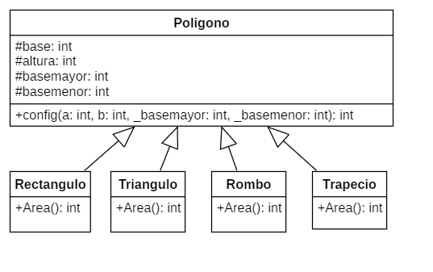
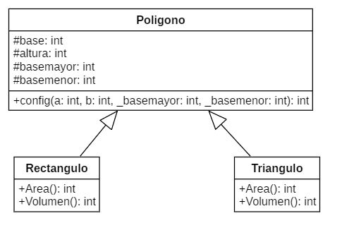
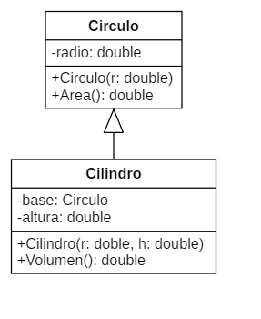
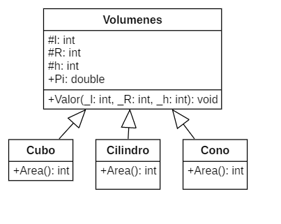

<h1 aling="Center">Ejercicios 15/03/2022</h1>

## 1. Ejercicio 1

### 1.1 Diagrama



### 1.2 Pseudocodigo

```console
#incluir <iostream>
utilizando el espacio de nombres estándar;
clase Polígono{
protegido:
    int base, altura, basemayor, basemenor;
público:
    valor nulo(int a, int b, int _basemayor, int _basemenor)
    {
        base = b;
        altura = a;
        basemayor = _basemayor;
        basemenor = _basemenor;
    }
};
clase Rectangulo : poligono publico{
público:
    int area() { return base * altura; }
};
clase Triangulo : poligono publico{
público:
    int area() { return base * altura / 2; }
};
clase Rombo: Poligono publico{
público:
    int area() { return basemayor * basemenor / 2; }
};
clase Trapecio : poligono publico{
público:
    int area() { return basemayor * basemenor / 2; }
};
int principal(){
    Rectángulo recto;
    triángulo tria;
    Rombo rom;
    trapecio trampa;
    rect.valor(4, 3, 1, 1);
    tria.valor(8, 9, 1, 1);
    rom.valor(1, 1, 5, 5);
    traP.valor(1, 1, 2, 4);
    cout << "area del Rectangulo es: " << rect.area() << endl;
    cout << "Area del triangulo: " << tria.area() << endl;
    cout << "Area del Rombo: " << rom.area() << endl;
    cout << "Area del Trapecio es: " << traP.area() << endl;
}
```

### 1.3 Codigo

```c++
#include <iostream>
using namespace std;
class Poligono{
protected:
    int base, altura, basemayor, basemenor;
public:
    void valor(int a, int b, int _basemayor, int _basemenor)
    {
        base = b;
        altura = a;
        basemayor = _basemayor;
        basemenor = _basemenor;
    }
};
class Rectangulo : public Poligono{
public:
    int area() { return base * altura; }
};
class Triangulo : public Poligono{
public:
    int area() { return base * altura / 2; }
};
class Rombo : public Poligono{
public:
    int area() { return basemayor * basemenor / 2; }
};
class Trapecio : public Poligono{
public:
    int area() { return basemayor * basemenor / 2; }
};
int main(){
    Rectangulo rect;
    Triangulo tria;
    Rombo rom;
    Trapecio traP;
    rect.valor(4, 3, 1, 1);
    tria.valor(8, 9, 1, 1);
    rom.valor(1, 1, 5, 5);
    traP.valor(1, 1, 2, 4);
    cout << "area del Rectangulo es: " << rect.area() << endl;
    cout << "Area del triangulo: " << tria.area() << endl;
    cout << "Area del Rombo: " << rom.area() << endl;
    cout << "Area del Trapecio es: " << traP.area() << endl;
}
```

### 1.4. Ejecutable

```console
$ cd "c:\Users\xXC4R\Desktop\Programacion\2ndo_parcial\03-15-22\" ; if ($?) { g++ tempCodeRunnerFile.cpp -o tempCodeRunnerFile } ; if ($?) { .\tempCodeRunnerFile }
area del Rectangulo es: 12
Area del triangulo: 36
Area del Rombo: 12
Area del Trapecio es: 4
```

## 2. Ejercicio 2

### 2.1 Diagrama



### 2.2 Pseudocodigo

```console
#incluir <iostream>
utilizando el espacio de nombres estándar;
clase Polígono{
protegido:
    int base, altura;
público:
    Polígono(int a, int b) : base(b), altura(a) {}
};
salida de clase{
público:
    static void imprimir(int i);
};
void Salida::imprimir(int i){
    cout << i << endl;
}
clase Rectangulo : public Poligono, public Salida{
público:
    Rectángulo(int a, int b) : Polígono(a, b) {}
    int area() { return base * altura; }
};
clase Triangulo : public Poligono, public Salida{
público:
    Triángulo(int a, int b) : Polígono(a, b) {}
    int area() { return base * altura / 2; }
};
int principal(){
    Rectángulo rec(3, 5);
    triangulo tria(9, 8);
    rec.imprimir(rec.area());
    Triangulo::imprimir(tria.area());
    devolver 0;
}
```

### 2.3 Codigo

```c++
#include <iostream>
using namespace std;
class Poligono{
protected:
    int base, altura;
public:
    Poligono(int a, int b) : base(b), altura(a) {}
};
class Salida{
public:
    static void imprimir(int i);
};
void Salida::imprimir(int i){
    cout << i << endl;
}
class Rectangulo : public Poligono, public Salida{
public:
    Rectangulo(int a, int b) : Poligono(a, b) {}
    int area() { return base * altura; }
};
class Triangulo : public Poligono, public Salida{
public:
    Triangulo(int a, int b) : Poligono(a, b) {}
    int area() { return base * altura / 2; }
};
int main(){
    Rectangulo rec(3, 5);
    Triangulo tria(9, 8);
    rec.imprimir(rec.area());
    Triangulo::imprimir(tria.area());
    return 0;
}
```

### 2.4. Ejecutable

```console
$ cd "c:\Users\xXC4R\Desktop\Programacion\2ndo_parcial\03-16-22\" ; if ($?) { g++ tempCodeRunnerFile.cpp -o tempCodeRunnerFile } ; if ($?) { .\tempCodeRunnerFile }
15
36
```

## 3. Ejercicio 3

### 3.1 Diagrama



### 3.2 Pseudocodigo

```console
#incluir <iostream>
utilizando el espacio de nombres estándar;
círculo de clase{
    radio doble;
público:
    Circulo(doble r) : radio(r) {}
    área doble () {volver radio * radio * 3.14159265; }
};
clase Cilindro{
    Base circular;
    doble altura;
público:
    Cilindro(doble r, doble h) : base(r), altura(h) {}
    double volumen() { return base.area() * altura; }
};
int principal(){
    Cilindro foo(34, 67);
    cout << "El volumen es : " << foo.volumen() << endl;
}
```

### 3.3 Codigo

```c++
#include <iostream>
using namespace std;
class Circulo{
    double radio;
public:
    Circulo(double r) : radio(r) {}
    double area() { return radio * radio * 3.14159265; }
};
class Cilindro{
    Circulo base;
    double altura;
public:
    Cilindro(double r, double h) : base(r), altura(h) {}
    double volumen() { return base.area() * altura; }
};
int main(){
    Cilindro foo(34, 67);
    cout << "El volumen es : " << foo.volumen() << endl;
}
```

### 3.4. Ejecutable

```console
$ cd "c:\Users\xXC4R\Desktop\Programacion\2ndo_parcial\03-15-22\" ; if ($?) { g++ tempCodeRunnerFile.cpp -o tempCodeRunnerFile } ; if ($?) { .\tempCodeRunnerFile }
El volumen es : 243323
```

## 4. Ejercicio 4

### 4.1 Diagrama



### 4.2 Pseudocodigo

```console
#incluir <iostream>
#incluir <matemáticas.h>
utilizando el espacio de nombres estándar;
Volúmenes de clase{
protegido:
    intl, R, h;
público:
    doble Pi = 3,141592;
    valor vacío (int _l, int _R, int _h)
    {
        l = _l;
        R = _R;
        h = _h;
    }
};
clase Cubo : Volúmenes públicos{
público:
    int area() { return pow(l, 3); }
};
clase Cilindro : public Volumenes{
público:
    int area() { return pow(R, 2) * Pi * h; }
};
clase Cono : Volumenes publicos{
público:
    int area() { return ((pow(R, 2) * Pi) / 3) * h; }
};
int principal(){
    Cubo cachorro;
    Cilindro cilios;
    Cono co;
    cub.valor(2, 1, 1);
    cili.valor(1, 8, 4);
    co.valor(1, 5, 3);
    cout << "El volumen del cubo es: " << cub.area() << endl;
    cout << "El volumen del cilindro es: " << cili.area() << endl;
    cout << "El volumen del cono es: " << co.area() << endl;
}
```

### 4.3 Codigo

```c++
#include <iostream>
#include <math.h>
using namespace std;
class Volumenes{
protected:
    int l, R, h;
public:
    double Pi = 3.141592;
    void valor(int _l, int _R, int _h)
    {
        l = _l;
        R = _R;
        h = _h;
    }
};
class Cubo : public Volumenes{
public:
    int area() { return pow(l, 3); }
};
class Cilindro : public Volumenes{
public:
    int area() { return pow(R, 2) * Pi * h; }
};
class Cono : public Volumenes{
public:
    int area() { return ((pow(R, 2) * Pi) / 3) * h; }
};
int main(){
    Cubo cub;
    Cilindro cili;
    Cono co;
    cub.valor(2, 1, 1);
    cili.valor(1, 8, 4);
    co.valor(1, 5, 3);
    cout << "El volumen del cubo es: " << cub.area() << endl;
    cout << "El volumen del cilindro es: " << cili.area() << endl;
    cout << "El volumen del cono es: " << co.area() << endl;
}
```

### 4.4 Ejecutable

```console
$ cd "c:\Users\xXC4R\Desktop\Programacion\2ndo_parcial\03-15-22\" ; if ($?) { g++ tempCodeRunnerFile.cpp -o tempCodeRunnerFile } ; if ($?) { .\tempCodeRunnerFile }
El volumen del cubo es: 8
El volumen del cilindro es: 804
El volumen del cono es: 78
```
