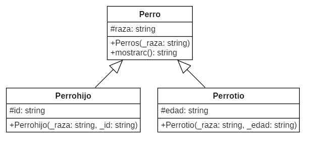

<h1 aling="Center">Ejercicios 16/03/2022</h1>

## 1. Ejercicio 1

### 1.1 Diagrama


### 1.2 Pseudocodigo

```console
#incluir <iostream>
utilizando el espacio de nombres estándar;
clase mamá{
público:
    Mamá(){
        cout << "Mama: hijo indispensables" << endl;
    }
    Mamá (int a) {
        cout << "Mama: como crear energia" << endl;
    }
};
clase Tia: mamá pública{
público:
    Tia(int a) { cout << "Tia Alta, dedicada, divertida CLAUDIA" << endl; }
};
clase Hijos : public Mama{
público:
    Hijos(int a) : Mama(a) { cout << "Hijos de la boveda celeste bendicion" << endl; }
};
int principal(){
    Tía Claudia(0);
    Hijos Luis(0);
    devolver 0;
}
```

### 1.3 Codigo

```c++
#include <iostream>
using namespace std;
class Mama{
public:
    Mama(){
        cout << "Mama: son indispensables" << endl;
    }
    Mama(int a){
        cout << "Mama: como crear energia" << endl;
    }
};
class Tia : public Mama{
public:
    Tia(int a) { cout << "Tia Alta, dedicada, divertida CLAUDIA" << endl; }
};
class Hijos : public Mama{
public:
    Hijos(int a) : Mama(a) { cout << "Hijos de la boveda celeste bendicion" << endl; }
};
int main(){
    Tia Claudia(0);
    Hijos Luis(0);
    return 0;
}
```

### 1.4. Ejecutable

```console
$ cd "c:\Users\xXC4R\Desktop\Programacion\2ndo_parcial\03-16-22\" ; if ($?) { g++ tempCodeRunnerFile.cpp -o tempCodeRunnerFile } ; if ($?) { .\tempCodeRunnerFile }
Mama: son indispensables
Tia Alta, dedicada, divertida CLAUDIA
Mama: como crear energia
Hijos de la boveda celeste bendicion
```

## 2. Ejercicio 2

### 2.1 Diagrama


### 2.2 Pseudocodigo

```console
#incluir <iostream>
utilizando el espacio de nombres estándar;
clase Polígono{
protegido:
    int base, altura;
público:
    Polígono(int a, int b) : base(b), altura(a) {}
};
salida de clase{
público:
    static void imprimir(int i);
};
void Salida::imprimir(int i){
    cout << i << endl;
}
clase Rectangulo : public Poligono, public Salida{
público:
    Rectángulo(int a, int b) : Polígono(a, b) {}
    int area() { return base * altura; }
};
clase Triangulo : public Poligono, public Salida{
público:
    Triángulo(int a, int b) : Polígono(a, b) {}
    int area() { return base * altura / 2; }
};
int principal(){
    Rectángulo rec(3, 5);
    triangulo tria(9, 8);
    rec.imprimir(rec.area());
    Triangulo::imprimir(tria.area());
    devolver 0;
}
```

### 2.3 Codigo

```c++
#include <iostream>
using namespace std;
class Poligono{
protected:
    int base, altura;
public:
    Poligono(int a, int b) : base(b), altura(a) {}
};
class Salida{
public:
    static void imprimir(int i);
};
void Salida::imprimir(int i){
    cout << i << endl;
}
class Rectangulo : public Poligono, public Salida{
public:
    Rectangulo(int a, int b) : Poligono(a, b) {}
    int area() { return base * altura; }
};
class Triangulo : public Poligono, public Salida{
public:
    Triangulo(int a, int b) : Poligono(a, b) {}
    int area() { return base * altura / 2; }
};
int main(){
    Rectangulo rec(3, 5);
    Triangulo tria(9, 8);
    rec.imprimir(rec.area());
    Triangulo::imprimir(tria.area());
    return 0;
}
```

### 2.4. Ejecutable

```console
$ cd "c:\Users\xXC4R\Desktop\Programacion\2ndo_parcial\03-16-22\" ; if ($?) { g++ tempCodeRunnerFile.cpp -o tempCodeRunnerFile } ; if ($?) { .\tempCodeRunnerFile }
15
36
```

## 3. Ejercicio 3

### 3.1 Diagrama



### 3.2 Pseudocodigo

```console

#incluir <iostream>
utilizando el espacio de nombres estándar;
clase Perros{
privado:
    cadena raza;
público:
    Perros(cadena _raza){
        raza = _raza;
    }
    cadena mostrarc(){
        volver raza;
    }
};
clase Perrohijo : Perros públicos{
privado:
    identificación de cadena;
público:
    Perrohijo(cadena _raza, cadena _id) : Perros(_raza){
        identificación = _id;
    }
    cadena mostrar(){
        identificación de retorno;
    }
};
clase Perrotio : Perros públicos{
privado:
    cadena de edad;
público:
    Perrotio(cadena _raza, cadena _edad) : Perros(_raza){
        edad = _edad;
    }
    cadena mostrarp(){
        volver edad;
    }
};
int principal(){
    Perrohijo p1("Esnauzer", "252403");
    Perrotio pt1("Esnauzer", "5 años");
    cout << "El id del perro hijo es: " << p1.mostrar() << endl << "Y su raza es: " << p1.mostrar() << endl;
    cout << "El id del perro tio es: " << pt1.mostrarp() << endl << "Y su raza es: " << p1.mostrarc() << endl;
};
```

### 3.3 Codigo

```c++
#include <iostream>
using namespace std;
class Perros{
private:
    string raza;
public:
    Perros(string _raza){
        raza = _raza;
    }
    string mostrarc(){
        return raza;
    }
};
class Perrohijo : public Perros{
private:
    string id;
public:
    Perrohijo(string _raza, string _id) : Perros(_raza){
        id = _id;
    }
    string mostrar(){
        return id;
    }
};
class Perrotio : public Perros{
private:
    string edad;
public:
    Perrotio(string _raza, string _edad) : Perros(_raza){
        edad = _edad;
    }
    string mostrarp(){
        return edad;
    }
};
int main(){
    Perrohijo p1("Esnauzer", "252403");
    Perrotio pt1("Esnauzer", "5 años");
    cout << "El id del perro hijo es: " << p1.mostrar() << endl << "Y su raza es: " << p1.mostrarc() << endl;
    cout << "El id del perro tio es: " << pt1.mostrarp() << endl << "Y su raza es: " << p1.mostrarc() << endl;
};
```

### 3.4. Ejecutable

```console
$ cd "c:\Users\xXC4R\Desktop\Programacion\2ndo_parcial\03-16-22\" ; if ($?) { g++ tempCodeRunnerFile.cpp -o tempCodeRunnerFile } ; if ($?) { .\tempCodeRunnerFile }
El id del perro hijo es: 252403
Y su raza es: Esnauzer
El id del perro tio es: 5 años
Y su raza es: Esnauzer
```

## 4. Ejercicio 4

### 4.1 Diagrama


### 4.2 Pseudocodigo

```console
#incluir <iostream>
#incluir <matemáticas.h>
utilizando el espacio de nombres estándar;
círculos de clase{
protegido:
    doble radio, altura;
público:
    doble pi = 3,141592;
    Circulos(doble r, doble h) : radio(r), altura(h) {}
};
salida de clase{
público:
    impresión doble estática(doble i);
};
doble Salida::imprimir(doble i){
    cout << i << endl;
}
clase Cono : public Circulos, public Salida{
público:
    Cono(int r, int h) : Círculos(r, h) {}
    double volumen() { return (pow(radio, 2) * altura * pi) / 3; }
};
clase Cilindro : public Circulos, public Salida{
público:
    Cilindro(int r, int h) : Circulos(r, h) {}
    double volumen() { return pow(radio, 2) * altura * pi; }
};
int principal(){
    Cono co(3, 5);
    Cilindro cil (3, 5);
    co.imprimir(co.volumen());
    Cilindro::imprimir(cili.volumen());
    devolver 0;
}
```

### 4.3 Codigo

```c++
#include <iostream>
#include <math.h>
using namespace std;
class Circulos{
protected:
    double radio, altura;
public:
    double pi = 3.141592;
    Circulos(double r, double h) : radio(r), altura(h) {}
};
class Salida{
public:
    static double imprimir(double i);
};
double Salida::imprimir(double i){
    cout << i << endl;
}
class Cono : public Circulos, public Salida{
public:
    Cono(int r, int h) : Circulos(r, h) {}
    double volumen() { return (pow(radio, 2) * altura * pi) / 3; }
};
class Cilindro : public Circulos, public Salida{
public:
    Cilindro(int r, int h) : Circulos(r, h) {}
    double volumen() { return pow(radio, 2) * altura * pi; }
};
int main(){
    Cono co(3, 5);
    Cilindro cili(3, 5);
    co.imprimir(co.volumen());
    Cilindro::imprimir(cili.volumen());
    return 0;
}
```

### 4.4 Ejecutable

```console
$ cd "c:\Users\xXC4R\Desktop\Programacion\2ndo_parcial\03-16-22\" ; if ($?) { g++ main4.cpp -o main4 } ; if ($?) { .\main4 }
47.1239
141.372
```
